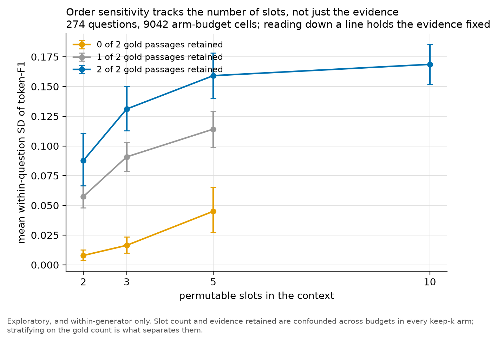

# rag-permutation-study

**Is it the pruning, or the ordering?** A permutation-controlled re-evaluation of
context selection in RAG.

> **[Read the full technical write-up in `WRITEUP.md`.](WRITEUP.md)**
> This page is the short version. The write-up has the design, the statistics,
> the complete result tables and the limitations.

---

## The plain-English version

When a chatbot answers a question by looking things up, something has to fetch
the relevant documents and paste them into the model's prompt. Ten paragraphs,
say. Long prompts are slow and expensive, so there is now a whole category of
tools that read those ten and throw most of them away, keeping the two or three
that matter. Everyone tests these tools the same way: feed the documents in,
check the answer is still right.

Two things were already known. Language models care about the order things appear
in their prompt, so the same paragraphs in a different sequence can produce a
different answer. And pruning tools throw paragraphs away.

Those two facts interact. When you delete paragraphs 3, 5 and 7 from a list of
ten, you do not only remove them. You promote everything underneath.
Paragraph 8 slides up into a more prominent slot. So when a pruning tool looks
like it is working, some of that might not be careful selection at all. It might
be lucky repositioning. And because every published evaluation uses one fixed
order, it has no way of telling the two apart.

So I ran two controls.

The first is just shuffling. Ask the same question five times over, with the
surviving paragraphs in a different order each time. Same words, same content,
nothing else touched.

The second is the one that does the real work. It is a placebo pruner: it throws
away exactly as many paragraphs as a real tool, but picks them by position alone,
without reading a word. Think of testing someone who claims they can pick the three best bottles
out of ten by taste. You compare them against a person who just grabs bottles 1,
9 and 10 and never opens any of them. If the expert cannot beat that, they are
not really tasting.

Here is what came out.

**Order changes the answer far more often than I expected.** Same paragraphs,
same wording, nothing random left in the model's settings. Just shuffled. The answer changes about half
the time, and when it changes it changes a lot. Only about a third of questions
give a byte-for-byte identical answer every single time.

**The pruning tools are doing real work.** They beat the placebo comfortably. I
set out to test whether they were mostly exploiting position, and they are not.
That was my main hypothesis and it did not hold.

**But they barely beat a very crude baseline.** The gap between a sophisticated
pruner and a simple one turns out to be smaller than the wobble you get from
reshuffling the same paragraphs. Which method you pick matters less than a
formatting decision that usually goes unreported.

**Pruning is still worth doing.** Keep about a quarter of the text and answer
quality does not measurably drop, at least on the one thing I measured. Speed and
running costs I did not measure at all, so that sentence is narrower than it
sounds.

**And then the strange one.** Ask a language model which three paragraphs to
keep. Then show it the same three paragraphs in a different order and ask again.
It picks differently, in 98 cases out of 100. In 23 of those the two attempts had
no paragraph in common whatsoever. The tool does not really have an answer. It
has a distribution over answers, and a single run gives you one draw from it.

I ran the whole thing again on a model nine times bigger, to see whether any of
this is just an artefact of a small model. It is not. The effect is still there,
at roughly a quarter the size, so it survives but the exact numbers do not carry
across.

The part I care most about is not a result. Before
collecting any data I wrote down what I expected, what would count as success,
and exactly which comparisons I would run, then committed that to version control
so the timestamps prove it. That is what stops you quietly redefining success
once you have seen how things turned out. Next to it there is a log of every
mistake I found afterwards, published in full: a caching bug that quietly
corrupted one method's results from the day it was written, a statistic that
reported a rounding error as a real finding, a check I had promised in advance to
run and then never ran. None of them changed a conclusion. They are all in there
anyway, because a log that records only the things that went right would not be
much of a log.

---

## The same thing, in the vocabulary of the field

This is not a new pruning method. It is an evaluation protocol, two controls, and
a set of numbers.

The problem, stated precisely: a context pruning method is scored against a
reference point that **moves when the method acts**, because discarding passages
also repositions the ones that survive. Reported gains therefore confound
evidence selection with positional promotion, and a single-order evaluation
cannot separate them.

The protocol holds passage content fixed and varies presentation order, which
isolates the position effect, and scores every method against a placebo that
discards the same number of passages by position alone, which isolates the
selection effect.

---

## What I found

*All of it in one setting: HotpotQA distractor, a 4-bit Qwen2.5-3B-Instruct
generator, greedy decoding, scored with token-F1. A 27B replication (6) says how
far the magnitudes carry, which is not far. The protocol is the part meant to
transfer.*

**1. Reordering an identical context changes the answer about half the time.**
Same passages, same words, greedy decoding, only the order differs. Half of
questions swing by about 0.39 token-F1, on a metric bounded at 0 and 1. There is
no "typical" question: the distribution has two modes and little in between.

Being careful about what "unchanged" means: on the other half the *score* does not
move, but the model still gives a different answer on 15% of all questions, wrong
in a different way each time and scoring zero either way. Only **35%** of
questions return a byte-identical answer under all five orderings.


Not a formatting artifact: re-running the whole thing with the context fenced in
`<context>` tags instead of bare moves the effect by **0.0047** token-F1
([-0.0140, 0.0239]), a difference that does not separate from zero. That was a
check registered before the main run.

**What drives it is the number of slots, not only the evidence.** Holding the
retained gold passages fixed and varying only how many passages the context
presents, the swing still rises, by **+0.0372 to +0.0809** token-F1 going from 2
slots to 5 or 10, in every evidence stratum. It even holds when the context
contains *neither* gold passage. Most of the sensitivity is bought by the first
few slots and it flattens after five, so pruning hard reduces order sensitivity
as a side effect.



**2. But pruning methods really are selecting on content, not position.** This
was the study's main hypothesis and the data did not support it. I built a
placebo that drops the same number of
passages by position alone, without reading them. Real pruners beat it by
**+0.2760 token-F1** (95% CI [0.2223, 0.3297]), at every budget tested. The
control behaves too: an arm that drops passages at random is indistinguishable
from the placebo, exactly as it should be.


**3. Yet no method beats a plain baseline by more than the noise that ordering
alone creates.** Measure each method's gain in units of "how much does the score
move when you just reshuffle the passages", and every practical method fails to
separate from simple rerank-and-truncate. The one arm that clears that bar is a
cheating upper bound that peeks at the answer. Put carefully: **in this setting,
the spread between pruning methods is smaller than the spread a single method
shows across orderings of the same passages.**

**4. Aggressive pruning costs little here, on the one axis measured.** Against
keeping all ten passages, the best pruner reduces the context to **27%** with no
statistically distinguishable loss in token-F1 (**-0.011**, [-0.0510, +0.0284]);
a plain rerank-and-truncate loses 0.045 and does separate from zero. Read that
narrowly: "cost" here means answer quality under token-F1 on this dataset and
generator. Latency, compute, and the pruner's own selection overhead are not
measured anywhere in this study, and a reranker or an LLM pruner is not free on
any of them.

**5. Two methods are order-dependent inside themselves, not just in their
scores.** The same effect, one level further in.

- Ask an LLM which passages to keep, then show it the same passages in a
  different order, and it picks different ones. Agreement between its three
  selections is **0.213** (1.000 would mean order makes no difference, 0.047 is
  random guessing). **The selection changed in 98 of 100 questions, and in 23 of
  them the three attempts had no passage in common at all.**
- LLMLingua-2 compresses a concatenated context differently depending on the
  order it is given: **0 of 100** passages survive identically across orderings
  when applied the normal way, to the whole context at once. Unlike the pruner
  this is expected rather than anomalous, since reordering genuinely changes its
  input. What is worth knowing is the scale of it, because people treat the
  compressed output as a property of the passage set and not one passage in a
  hundred survives that assumption.

The LLM pruner also fails to name the requested number of passages in **24.3%**
of cases, and that rate reproduces to four decimal places on a 27B model from a
different size class (0.2432 against 0.2433), so it is a property of asking a
model to name k items rather than a quirk of one small model.

**6. The effect survives a 9x jump in model size, at about a quarter the
size.** A hosted replication on a 27B model was matched to the main run exactly:
the same questions, the same three orderings, byte-identical passage orders, so
only the generator differs. Order sensitivity is intact, with every interval
excluding zero at the primary budget, but on an un-pruned context the 3B's swing
is **4.5x** the 27B's
(0.1668 against 0.0374, paired difference 0.1294 [0.0679, 0.1910]). The 27B
still answers 16% of questions differently on order alone. So the *protocol*
transfers and the *magnitudes* do not, and the numbers above should be read as
belonging to a 3B rather than to generators in general. The placebo gap
replicates at 27B; the LLM pruner's budget defect is scale-invariant where the
ordering effect is not.


**Memorization is not the explanation.** Only **8.7%** of questions can be
answered exactly with no passages at all, and the analysis is restricted to the
questions the model gets wrong without context, where the no-context score is
0.0089 token-F1. Worth knowing for anyone reusing the protocol:
that rate triples with scale, to 26% on the 27B, which is why the filter is
recomputed per generator rather than shared.

---

## How it works, briefly

- **Data.** HotpotQA distractor: ten paragraphs per question, two of them
  relevant, no retrieval needed.
- **Generator.** Qwen2.5-3B-Instruct, 4-bit, run locally, greedy decoding
  everywhere so that sampling noise cannot be confused with ordering noise.
- **The protocol.** For every (question, method, budget), generate under five
  different orderings of whatever the method kept.
- **The key control.** `placebo_pos` drops k passages by position and never reads
  them. If a method cannot beat that at equal keep-count, it is not selecting on
  content.
- **Statistics.** Permutations are nested inside questions, so resampling treats
  the question as the unit and carries all five permutations with it. Treating
  the cells as independent would inflate the sample fivefold and manufacture
  significance.
- **Pre-registered.** Hypotheses, primary endpoint, analysis population and
  multiplicity family were all fixed and committed before any main-run data
  existed. The plan is [`ANALYSIS_PLAN.md`](ANALYSIS_PLAN.md), and its Section 9
  logs **every** departure from it, including a dozen errors caught after the
  fact with the measured impact of each. The registered text is retrievable at
  commit `2f24548`, dated two days before the first main-run result.

The scale: **45,510 generations**, 11 arms, 274 questions, 3 budgets, 5
permutations, plus **1,655 hosted calls** for the 27B replication.

`WRITEUP.md` covers all of this properly, including the parts that are easy to
get wrong.

---

## Running

```bash
python -m pip install -r requirements.txt      # torch must come from the CUDA index
```

| Task | Command |
|---|---|
| GPU smoke test | `python -m src.smoke` |
| Main run | `python -m src.run --config configs/main.yaml` |
| Analysis | `python -m src.analyze --config configs/main.yaml` |
| Figures | `python -m src.figures --config configs/main.yaml` |
| Selection-stability probe | `python -m src.selection_probe --config configs/main.yaml --n 100` |
| Hosted 27B replication | `python -m src.run --config configs/replication.yaml` |
| Matched 3B vs 27B comparison | `python -m src.generator_comparison` |
| Delimiter robustness check | `python -m src.run --config configs/robustness_delimiter.yaml` then `python -m src.delimiter_check` |
| Slot-count analysis | `python -m src.slot_count` |
| Tests | `python -m pytest -q -m "not network"` |

Every generation is cached on a hash of the model, prompt and decode parameters,
and flushed as it goes, so reruns are free and interrupting a long run loses
nothing.

Useful flags: `--backend dummy` exercises the whole pipeline with no GPU (its
numbers are meaningless by construction), `--n 20` shrinks the question set,
`--arms full` restricts the grid.

## Status

| Piece | State |
|---|---|
| pipeline, all 11 arms, caching, statistics | done |
| main run, 45,510 generations | done |
| confirmatory analysis and figures | done |
| robustness: same analysis on the unfiltered 300 | done |
| hosted cross-generator replication at 27B, 1,655 calls | done |
| determinism audit of the hosted generator | done, 50/50 across three days |
| registered robustness: prompt-delimiter variant | done, effect unchanged |
| slot-count decomposition | done, from data already collected |

**255 tests** pass (`python -m pytest -q -m "not network"`, about 15s). Three
more are marked `network` and download the dataset on first run.

## Main limitations

Pruner checkpoints are used as published on a dataset they were not tuned for, so
this measures deployed behaviour rather than each method's ceiling. Results are
from one dataset and one model family, which is the main limitation. A
cross-family probe confirms the effect exists elsewhere but not its size, and a
27B replication within the same lineage shows it shrinking about fourfold with
scale, on two points, which cannot tell a smooth decay from a threshold. The
reference ordering is the dataset's own "as-given" paragraph order rather than a
retriever ranking, since the distractor setting has no retriever. The
Provence checkpoint is non-commercial (`cc-by-nc-nd-4.0`).

The full list is in [`WRITEUP.md`](WRITEUP.md), Section 6.

## Licence

MIT, see [`LICENSE`](LICENSE). Note this covers the code and documents here, not
the model checkpoints they load: the Provence checkpoint is released under
`cc-by-nc-nd-4.0` and its terms are its own.
