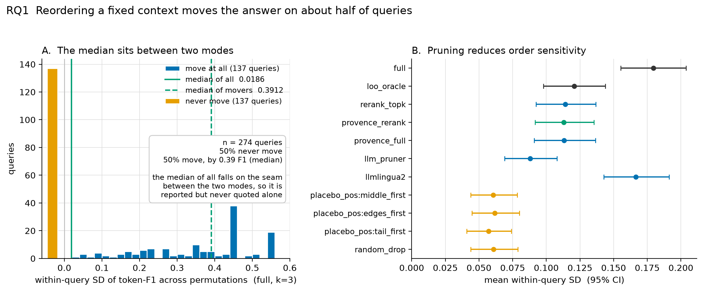
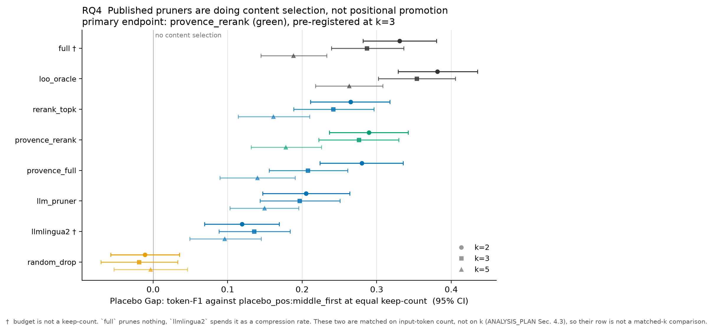
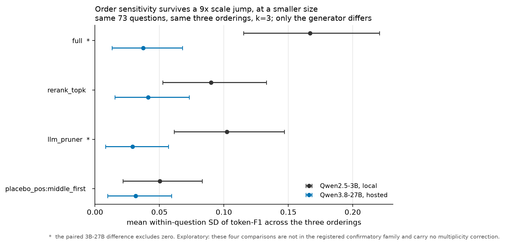

# rag-permutation-study

**Is it the pruning, or the ordering?** A permutation-controlled re-evaluation of
context selection in RAG.

> **[Read the full technical write-up in `WRITEUP.md`.](WRITEUP.md)**
> This page is the short version. The write-up has the design, the statistics,
> the complete result tables and the limitations.

---

## The question, in one paragraph

A RAG system retrieves passages and puts them in a prompt. Because context is
expensive, many published methods shorten that context by throwing most of it
away. All of them are evaluated with the passages in one fixed order.

Separately, it is well known that language models are sensitive to the order of
what is in their prompt.

Nobody had put those two facts together, and they interact. Pruning does not only
remove passages, it **moves the survivors into new positions**. Drop passages 3,
5 and 7 from a ten-passage context and passages 8, 9 and 10 get promoted into
more visible slots. So part of what looks like better evidence selection could
just be a lucky interaction with position, measured against a reference point
that moves when the method acts.

This study separates the two. It is not a new pruning method. It is an evaluation
protocol, two controls nobody runs, and a set of numbers.

---

## What we found

**1. Reordering an identical context changes the answer about half the time.**
Same passages, same words, greedy decoding, only the order differs. Half of
questions swing by about 0.39 token-F1, which is enormous. There is no "typical"
question: the distribution has two modes and almost nothing in between.

Being careful about what "unchanged" means: on the other half the *score* does not
move, but the model still gives a different answer on 14% of all questions, wrong
in a different way each time and scoring zero either way. Only **36%** of
questions return the identical answer under all five orderings.



**2. But pruning methods really are selecting on content, not position.** This
was the study's main hypothesis and it did not survive contact with the data,
which is the useful outcome. We built a placebo that drops the same number of
passages by position alone, without reading them. Real pruners beat it by
**+0.2760 token-F1** (95% CI [0.2223, 0.3297]), at every budget tested. The
control behaves too: an arm that drops passages at random is indistinguishable
from the placebo, exactly as it should be.



**3. Yet no method beats a plain baseline by more than the noise that ordering
alone creates.** Measure each method's gain in units of "how much does the score
move when you just reshuffle the passages", and every practical method fails to
separate from simple rerank-and-truncate. The one arm that clears that bar is a
cheating upper bound that peeks at the answer. The short version: **the method
you choose matters less than the order you happen to feed it in.**

**4. Two methods are order-dependent inside themselves, not just in their
scores.** This is the sharper version of the thesis.

- Ask an LLM which passages to keep, then show it the same passages in a
  different order, and it picks different ones. Agreement between its three
  selections is **0.213** (1.000 would mean order makes no difference, 0.047 is
  random guessing). **The selection changed in 98 of 100 questions, and in 23 of
  them the three attempts had no passage in common at all.**
- LLMLingua-2 compresses a concatenated context differently depending on the
  order it is given: **0 of 100** passages survive identically across orderings
  when applied the normal way, to the whole context at once. Unlike the pruner
  this is expected rather than anomalous, since reordering genuinely changes its
  input. What is worth knowing is the scale of it, because people treat the
  compressed output as a property of the passage set and not one passage in a
  hundred survives that assumption.

The LLM pruner also fails to name the requested number of passages in **24.3%**
of cases, and that rate reproduces to four decimal places on a 27B model from a
different size class (0.2432 against 0.2433), so it is a property of asking a
model to name k items rather than a quirk of one small model.

**5. The effect survives a 9x jump in model size, at about a quarter the
size.** A hosted replication on a 27B model was matched to the main run exactly:
the same questions, the same three orderings, byte-identical passage orders, so
only the generator differs. Order sensitivity is intact — every interval
excludes zero — but on an un-pruned context the 3B's swing is **4.5x** the 27B's
(0.1668 against 0.0374, paired difference 0.1294 [0.0679, 0.1910]). The 27B
still answers 16% of questions differently on order alone. So the *protocol*
transfers and the *magnitudes* do not, and the numbers above should be read as
belonging to a 3B rather than to generators in general. The placebo gap
replicates at 27B; the LLM pruner's budget defect is scale-invariant where the
ordering effect is not.



**Memorization is not the explanation.** Only 10% of questions can be answered
with no passages at all, and the analysis is restricted to the questions the
model gets wrong without context. Worth knowing for anyone reusing the protocol:
that rate triples with scale, to 26% on the 27B, which is why the filter is
recomputed per generator rather than shared.

---

## How it works, briefly

- **Data.** HotpotQA distractor: ten paragraphs per question, two of them
  relevant, no retrieval needed.
- **Generator.** Qwen2.5-3B-Instruct, 4-bit, run locally, greedy decoding
  everywhere so that sampling noise cannot be confused with ordering noise.
- **The protocol.** For every (question, method, budget), generate under five
  different orderings of whatever the method kept.
- **The key control.** `placebo_pos` drops k passages by position and never reads
  them. If a method cannot beat that at equal keep-count, it is not selecting on
  content.
- **Statistics.** Permutations are nested inside questions, so resampling treats
  the question as the unit and carries all five permutations with it. Treating
  the cells as independent would inflate the sample fivefold and manufacture
  significance.
- **Pre-registered.** Hypotheses, primary endpoint, analysis population and
  multiplicity family were all fixed and committed before any main-run data
  existed, and are retrievable at commit `2f24548`.

The scale: **45,510 generations**, 11 arms, 274 questions, 3 budgets, 5
permutations, plus **1,655 hosted calls** for the 27B replication.

`WRITEUP.md` covers all of this properly, including the parts that are easy to
get wrong.

---

## Running

```bash
python -m pip install -r requirements.txt      # torch must come from the CUDA index
```

| Task | Command |
|---|---|
| GPU smoke test | `python -m src.smoke` |
| Main run | `python -m src.run --config configs/main.yaml` |
| Analysis | `python -m src.analyze --config configs/main.yaml` |
| Figures | `python -m src.figures --config configs/main.yaml` |
| Selection-stability probe | `python -m src.selection_probe --config configs/main.yaml --n 100` |
| Hosted 27B replication | `python -m src.run --config configs/replication.yaml` |
| Matched 3B vs 27B comparison | `python -m src.generator_comparison` |
| Tests | `python -m pytest -q -m "not network"` |

Every generation is cached on a hash of the model, prompt and decode parameters,
and flushed as it goes, so reruns are free and interrupting a long run loses
nothing.

Useful flags: `--backend dummy` exercises the whole pipeline with no GPU (its
numbers are meaningless by construction), `--n 20` shrinks the question set,
`--arms full` restricts the grid.

## Status

| Piece | State |
|---|---|
| pipeline, all 11 arms, caching, statistics | done |
| main run, 45,510 generations | done |
| confirmatory analysis and figures | done |
| robustness: same analysis on the unfiltered 300 | done |
| hosted cross-generator replication at 27B, 1,655 calls | done |
| determinism audit of the hosted generator | done, 50/50 across three days |

**241 tests** pass (`python -m pytest -q -m "not network"`, about 15s). Three
more are marked `network` and download the dataset on first run.

## Main limitations

Pruner checkpoints are used as published on a dataset they were not tuned for, so
this measures deployed behaviour rather than each method's ceiling. Results are
from one dataset and one model family, which is the main limitation. A
cross-family probe confirms the effect exists elsewhere but not its size, and a
27B replication within the same lineage shows it shrinking about fourfold with
scale — two points, which cannot tell a smooth decay from a threshold. The
reference ordering is the dataset's own "as-given" paragraph order rather than a
retriever ranking, since the distractor setting has no retriever. The
Provence checkpoint is non-commercial (`cc-by-nc-nd-4.0`).

The full list is in [`WRITEUP.md`](WRITEUP.md), Section 6.
